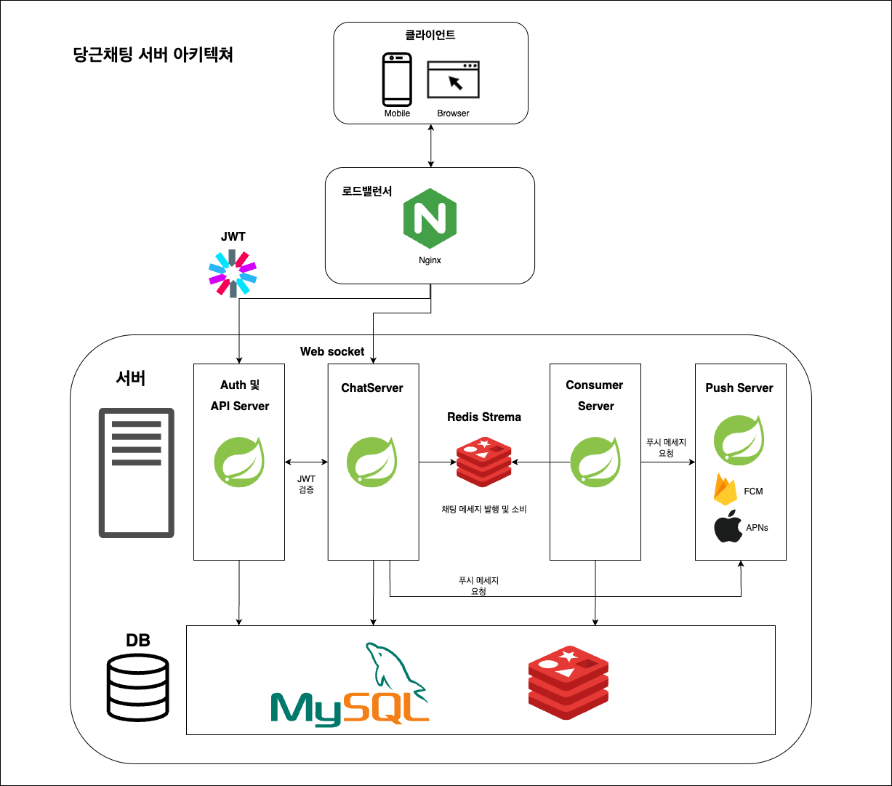

# Chat Server

이 프로젝트는 당근마켓과 유사한 **실시간 채팅 기능**을 제공하는 `Chat Server`입니다.  
**MSA** 기반으로 설계되어 Spring Boot 기반으로 구현되었으며, Redis Stream을 통해 메시지를 비동기적으로 처리하고, WebSocket을 통해 사용자와의 실시간 통신을 담당합니다.

## 🔧 기술 스택

- Java 21
- Spring Boot 3.4.4
- Redis / Redis Stream
- WebSocket (Command 기반 구현)
- MySQL (계정, 메시지 이력 저장용)
- Docker / Docker Compose (개발 및 테스트 환경 구성)

## 🧩 시스템 아키텍처

### 구성요소 설명

- **User (Browser / Mobile)**  
  WebSocket을 통해 실시간 채팅이 가능하며, 프론트엔드는 서버와 직접 연결되어 메시지를 송수신합니다.

- **[API Server](https://github.com/jgjung9/karrot-apiserver-clone)**
  사용자 인증 및 채팅방 정보, 유저 정보 등의 API를 제공합니다. JWT 토큰 검증 및 MySQL과의 인터랙션을 담당합니다.

- **Chat Server (💬)**
    - WebSocket을 통해 클라이언트와 실시간 메시지를 송수신합니다.
    - 메시지를 Redis Stream에 **produce** 하여 전달합니다.
    - Redis 또는 내부 메모리에 WebSocket 세션을 관리합니다.
    - JWT 토큰 기반 사용자 인증을 수행합니다.

- **[Consumer Server](https://github.com/jgjung9/karrot-consumerserver-clone)**
    - Redis Stream의 메시지를 **consume** 하여 MySQL에 영속화합니다.
    - 향후 Kafka 등으로 대체하거나 확장 가능한 구조로 설계되어 있습니다.

- **Push Server**
  - 유저에게 푸시 메시지를 전달을 담당하는 서버
  - FCM, APNs를 이용하여 유저 디바이스에 푸시 메시지 전달

- **Redis Stream**  
  메시지 큐 역할로 사용되며, Chat Server와 Consumer Server 간의 **비동기 처리**를 위한 핵심 컴포넌트입니다.

### 참고자료
- 당근 채팅 시스템은 어떻게 만들까? (https://www.youtube.com/watch?v=_F6k0tg8ODo&t=1462s)